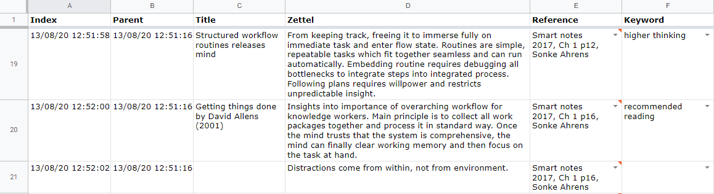
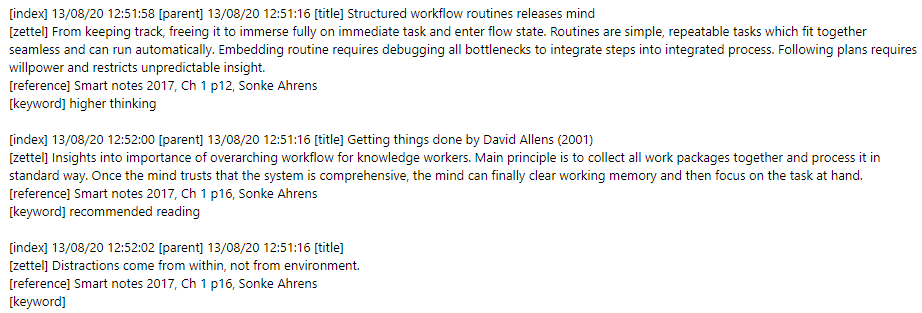

# Zettelkasten converter

This simple program converts zettelkasten between txt and csv formats.

[![NPM Version][npm-image]][npm-url]
[![Downloads Stats][npm-downloads]][npm-url]

# Background

I started my zettelkasten as notes in a text file, but then realised that a spreadsheet was a more suitable platform for searching and viewing groups of notes. Having already created several hundred notes, I created this program to export the existing notes into a spreadsheet.

Convert between this:



And this. Works both ways.



# What is a zettelkasten?

A zettelkasten is a system of notes pioneered by Niklas Luhmann, a prolific academic and one of the most important social theorists of the 20th century. Luhman used his zettelkasten as an external long term memory, in which he refined and stored ideas from his thinking and reading for later use. This allowed for an extremely product workflow in which certain topics would blossom in the zettelkasten, and Luhman could simply collate related notes together to form the first draft of an article or book.

## Installation

1. Fork and clone project from https://github.com/eyjho/zettelkasten_converter/
2. Navigate to the zettelkasten_converter main directory.
3. Run zettelkasten_converter\strategy.py.
```sh
git clone https://github.com/eyjho/zettelkasten_converter.git <directory>
cd <directory>
<directory>\zettelkasten_converter>python zettelkasten_converter\strategy.py
```

## Usage example


_For more examples and usage, please refer to the [Wiki][wiki]._

## Release History

* 0.2.1
    * CHANGE: Update docs (module code remains unchanged)
* 0.2.0
    * CHANGE: Remove `setDefaultXYZ()`
    * ADD: Add `init()`
* 0.1.1
    * FIX: Crash when calling `baz()` (Thanks @GenerousContributorName!)
* 0.1.0
    * The first proper release
    * CHANGE: Rename `foo()` to `bar()`
* 0.0.1
    * Work in progress

## Meta

Eugene (https://github.com/eyjho)

Distributed under the MIT license. See ``LICENSE`` for more information.

https://github.com/eyjho/zettelkasten_converter/

<!-- Markdown link & img dfn's -->
[npm-image]: https://img.shields.io/npm/v/datadog-metrics.svg?style=flat-square
[npm-url]: https://npmjs.org/package/datadog-metrics
[npm-downloads]: https://img.shields.io/npm/dm/datadog-metrics.svg?style=flat-square
[wiki]: https://github.com/eyjho/zettelkasten_converter/wiki
