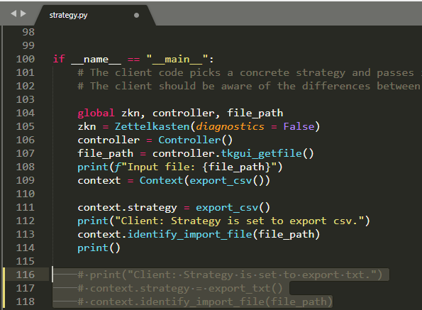

# Zettelkasten converter

This simple program converts zettelkasten between txt and csv formats.

# Background

I started my zettelkasten as notes in a text file, but then realised that a spreadsheet was a more suitable platform for searching and viewing groups of notes. Having already created several hundred notes, I created this program to export the existing notes into a spreadsheet.

Convert between this:


And this. Works both ways.


# What is a zettelkasten?

A zettelkasten is a system of notes pioneered by Niklas Luhmann, a prolific academic and one of the most important social theorists of the 20th century. Luhman used his zettelkasten as an external long term memory, in which he refined and stored ideas from his thinking and reading for later use. This allowed for an extremely product workflow in which certain topics would blossom in the zettelkasten, and Luhman could simply collate related notes together to form the first draft of an article or book.

## Installation

Clone project from https://github.com/eyjho/zettelkasten_converter/

Command line interface:
```sh
git clone https://github.com/eyjho/zettelkasten_converter.git <directory>
```

## Usage example
1. Place input file into <example> directory
2. Run zettelkasten_converter from installation <directory>
```
cd <directory>
<directory>\zettelkasten_converter>python zettelkasten_converter\strategy.py
```
3. Prompt will appear to select file. Navigate to input file and select.


4. Run zettelkasten_converter\strategy.py. This will automatically detect .txt and .csv files, and output both file types with a timestamp (Google Sheets numerical format) appended to the output file name.
```
Input file: <directory>/zettelkasten_converter/<example>/Zettelkasten v0_4.csv

Client: Strategy is set to export csv.
Context: Sorting data using the strategy
Exporting csv
New zettels: 307
Output file: <directory>/zettelkasten_converter/<example>/Zettelkasten v0_4_44077.229858.csv

Client: Strategy is set to export txt.
Context: Sorting data using the strategy
Exporting txt
New zettels: 307
Output file: <directory>/zettelkasten_converter/<example>/Zettelkasten v0_4_44077.229858.txt
```

To export only one file type, simply comment out the corresponding section of code in stratey.py.


_For more examples and usage, please refer to the [Wiki][wiki]._

## Release History

* 0.0.1
    * Work in progress

## Meta

Eugene (https://github.com/eyjho)

Distributed under the MIT license. See ``LICENSE`` for more information.

https://github.com/eyjho/zettelkasten_converter/

<!-- Markdown link & img dfn's -->
[npm-image]: https://img.shields.io/npm/v/datadog-metrics.svg?style=flat-square
[npm-url]: https://npmjs.org/package/datadog-metrics
[npm-downloads]: https://img.shields.io/npm/dm/datadog-metrics.svg?style=flat-square
[wiki]: https://github.com/eyjho/zettelkasten_converter/wiki
